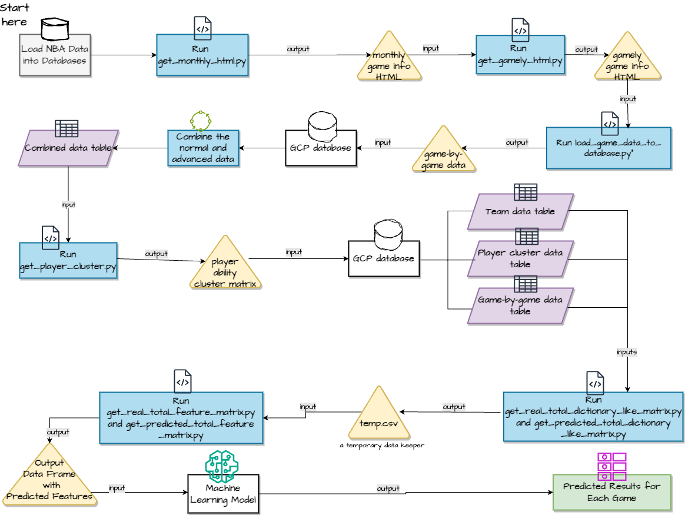
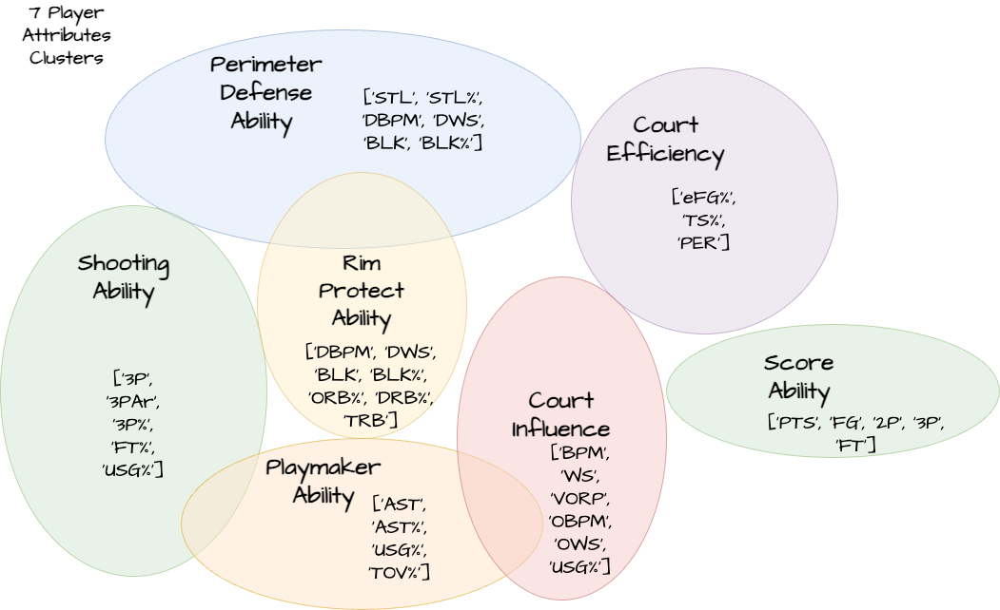

# 2023-24-NBA-Championship-Prediction


Team Members: [Zixuan Xu](https://github.com/ZixuanXu0116), [Munazza Ilyas](https://github.com/Munazza-Ilyas), [Suqian Qi](https://github.com/SuqianQi), [Aahil Navroz](https://github.com/AahilNav), [Joseph Williams](https://github.com/josephwms)

## Introduction
We aim to build a prediction pipeline for an NBA regular season and its playoffs. It is more like a semi-finished product with flaws. But the basic structure and the whole pipeline are built up. Significant techniques we used in the project include Data Scraping, K-means Clustering, Random Forest Classification, K-neighbors classifier, and Streamlit Dashboard. We hope you enjoy it!


## A. Data Scraping and Preparation
 
***Source:*** 
* Data was scraped from https://www.basketball-reference.com/. We scrape players' and teams' summary statistics for each season, differentiating between the regular season and playoffs data. Next, we scrape HTML files containing game-by-game data, allowing us to retrieve each player's performance and game outcomes for every match.

* A brief workflow of our pipeline is provided below:



***Construct Player Ability Cluster Vector:***
* After obtaining our raw data, we utilized a K-means machine learning classification algorithm for the Player Ability Cluster Vector. Different attributes were employed to classify distinct abilities, and we devised custom weights to calculate the ranking of each cluster. 




* The result is a **Player Ability Vector**. Each player is measured by seven attributes: shooting, peri_def, playmaker, pro_rim, efficiency, influence, and scoring. Each attribute ranges from 0 to 7, where 0 signifies the weakest ability in the respective attribute, while 7 indicates the strongest.


***Predict Next Year's Player Ability Vector:***
* For predicting the ability vector of a given year, we try to find some way to adjust the player's ability vectors in the last year to make it a predicted one for this year. 
* For the regular season, player's cluster scores were adjusted positively for younger players and negatively for older players. For playoffs, we gave positive adjustments to players who had played in the previous year's playoffs (experienced under pressure) and negative adjustments to rookies, or players who had not played in the previous year's playoffs.

## B. Making Prediction

***Construct Prediction Model:***
* With all the data prepared, we can proceed with the predictions. To predict the result of any game, we construct a machine-learning model. We treat the ability/attribute matrices for the two teams as the total features for predicting the result of a single game. The result column serves as the real outcome of each game and is used for validation and evaluation. By training the model on the results of all games from the 2015 to 2023 season, we aim to predict the outcomes of games in the 2024 season. For the simulation of each game, we can repeat n times by setting an iteration parameter, and choose the majority as the winner of that game.

***Play-in Games Prediction:***
* Since the rule of entering the playoffs changed after COVID-19, we added the play-in games into consideration. We designed an algorithm to simulate the play-in games based on the real rules so that we can determine which team makes the playoffs.


***Playoffs Prediction:***
* After simulating the regular season using the simulate_regular_season.py, we were able to identify the final top eight teams for each conference.  We conclude our process by running the simulate_playoffs.py, which predicts outcomes and winners for each round of the playoffs, taking into account home team advantage for each match (very relevant in playoffs!). We will let the results of all the playoff series output in the terminal, so you will witness the birth of a predicted NBA champion!


## C. Result & Model Evaluation

Here is an example dashboard of predicted results (it's a GIF) for the 2023-24 playoffs with an accuracy of 55.93% for predicting each game! The Predicted Champion is LAC! 


## D. Further Plans

* We plan to train a separate model for the playoff games


* Try more combinations of parameters for the cluster and cluster prediction
 
* Add a parameter to take fatigue into consideration

## E. Reproducing Results

### Our current model is not the best, we will continue modifying it, but anyway, the whole process is completed. All the things left are to enhance the model's performance. 

***Setup:***
* Create a Google Cloud Platform (GCP) account and set up a project.
* Enable the necessary APIs for your project, such as the PostgreSQL API if you're using PostgreSQL.
* Create a database on GCP.
* After the GCP database has been set up completely, please follow the commands and instructions below.

* Then create a .env file in the same format as demo.env by changing the attributes inside like passwords, host, and database_name to the ones of your own database. You can edit the content in the demo.env directly and then run:

```python
cp demo.env .env

```

* Then, set up the environment

```linux
sh code/environ.sh
```

***Scraping Data:***

```linux
sh code/scrape.sh
```

***Manipulating the Data:***

```linux
sh code/manipulate.sh
```
***Simulate the Results***

```linux
sh code/simulate.sh
```

### We created a Streamlit DashBoard to let you control the num_iterations for simulation:

```python
streamlit run code/model_and_simulation/streamlit_app.py
```

* Click 'Open the Browser' in the pop-up window after running the command above, wait for seconds and you will go to our dashboard webpage. Change the num_iterations to an odd positive number you want and click 'Run Simulation'. After you see the results of the regular season, you can then click 'Simulate Playoffs' at the bottom of this page. After minutes of waiting (depending on your num_iterations), you will get the score of each playoffs series and,

## You will witness the birth of the Champion!

***If you have any problems regarding the whole process, please use pulling requests or issues in this repo, or contact me through email: `zixuanxu@utexas.edu`.***


